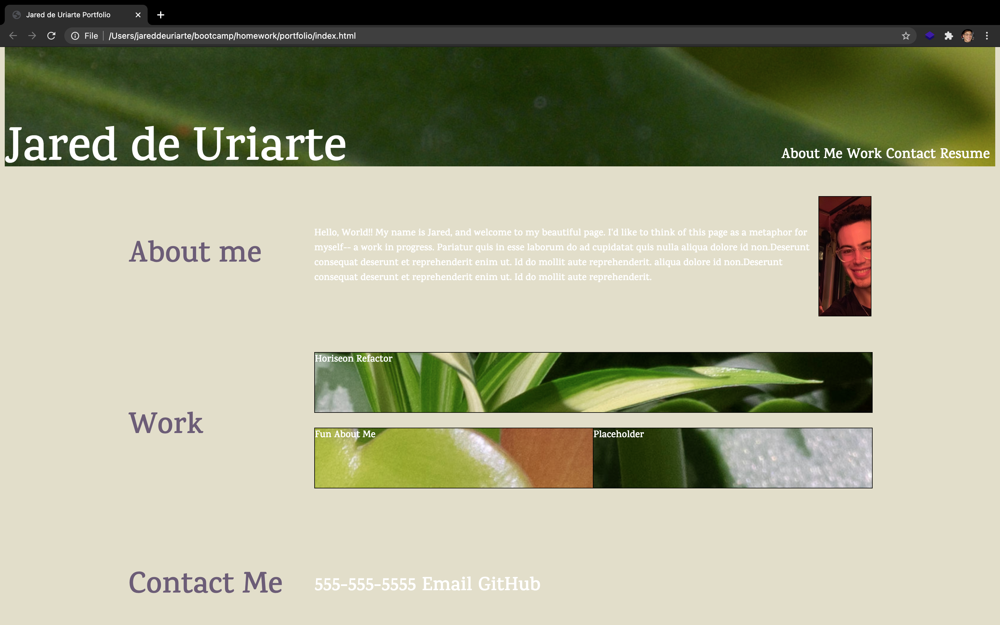
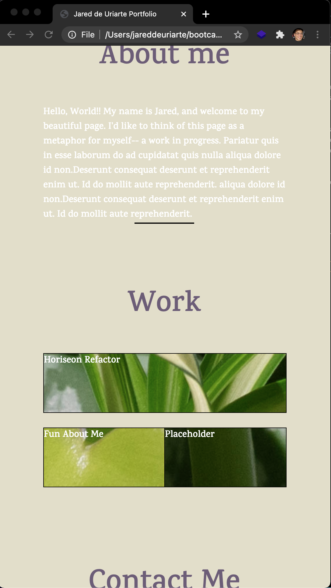

# # Jared de Uriarte's Portfolio

## Description
This application serves the purpose of organizing and showcasing my technical work as a web developer, as well as a brief introduction about myself. I anticipate as I progress as a web developer, so too will this application **in form and content**.  

### Method
Well, I definitely learned what not to do, which has put into clearer contrast how best to approach projects in the future. Namely, I must operationalize a methodic approach to testing out strategies, rather than just piling on code after code after code. This starts with wireframing beyond a freehand sketch. 

### Usage
To have a single location to showcase mywork.

### Credits
As always I'd like to thank my steadfast bootcamp cohort for all the collaborative help. Also a huge shout out to BCS Learning Assistants and my tutor. And Gregorgy.

### Tests
Application demonstartes **rudimentary** responsiveness. 

